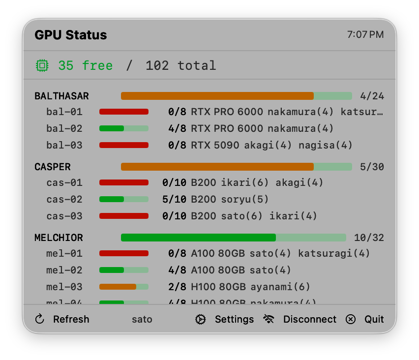

# GPUBar

GPUBar is a lightweight desktop app for monitoring GPU cluster availability at a glance.

- macOS app: native SwiftUI/AppKit menu bar app
- Windows app: native .NET 8 WPF tray app



## Features

- Live free GPU count and cluster summary
- Per-cluster and per-node breakdown
- Pending jobs queue
- GPU availability notifications
- One-click pairing via `gpubar://configure`
- Auto-refresh
- Tag-based release packaging for macOS and Windows

## Install

### macOS

Download the macOS zip from [Releases](../../releases), extract it, and move `GPUBar.app` to `/Applications`.

If macOS blocks it:

```bash
xattr -cr /Applications/GPUBar.app
```

### Windows

Download either of these from [Releases](../../releases):

- `GPUBar-Setup-<version>.exe` for the normal installer flow
- `GPUBar-<version>-windows-x64.zip` for a portable build

After install, GPUBar lives in the system tray. Open your GPU dashboard and click the GPUBar link button to pair via the `gpubar://configure` deep link.

## Build from Source

### macOS

Requires macOS 14+ and Swift 5.9+.

```bash
swift build -c release
```

To package the `.app` bundle:

```bash
./Scripts/package_app.sh
```

### Windows

Requires Windows 10/11 and .NET 8 SDK.

```powershell
dotnet build .\windows\GPUBar.Windows\GPUBar.Windows.csproj -c Release
```

Portable publish:

```powershell
dotnet publish .\windows\GPUBar.Windows\GPUBar.Windows.csproj -c Release -r win-x64 --self-contained true /p:PublishSingleFile=true
```

Installer build (after publish) uses Inno Setup with `windows/installer/GPUBar.iss`.

## Release Flow

Releases are tag-triggered.

1. Update `version.env`
2. Create and push a tag like `v1.1.0`
3. GitHub Actions builds:
   - macOS zip
   - Windows portable zip
   - Windows installer
4. The workflow publishes all artifacts to one GitHub Release

## Repo Layout

- `Sources/GPUBar/` — macOS app
- `windows/GPUBar.Windows/` — Windows app
- `windows/installer/` — Windows installer script
- `docs/windows-plan.md` — rollout and packaging plan

## License

MIT
